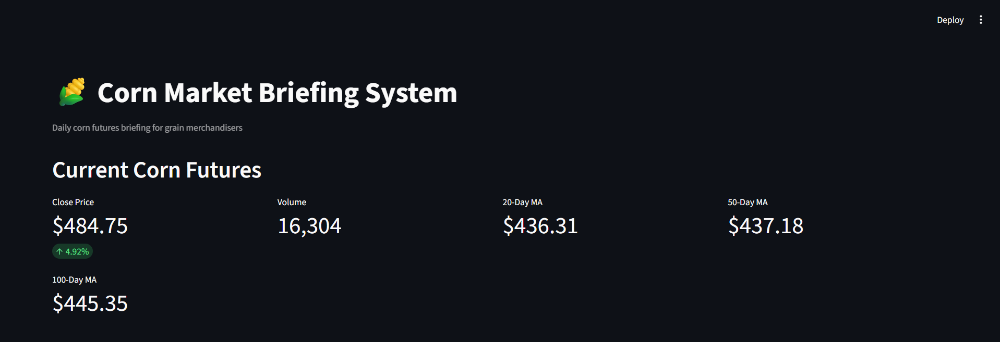

# 🌽 Corn Market Briefing System (CMBS)

A Python-based tool that answers one question: *if I were a junior grain merchandiser arriving at work at 8:00 AM, how could I understand today's corn market in under five minutes?*

Built as a hands-on project to develop both technical (Python, data pipelines, visualization) and fundamental (USDA WASDE reports, market analysis, trading judgment) skills relevant to a career in agricultural commodity trading.

## Why This Project

I'm an Agricultural Business & Management student at NC State University pursuing a career in commodity trading or grain merchandising. Rather than build a generic data analysis portfolio piece, this project is built around the actual daily workflow of a junior grain merchandiser - combining real market data with real USDA fundamentals and genuine, self-written trading analysis.

## What It Does

- Pulls live corn futures data (CBOT, ticker ZC=F) via the Yahoo Finance API
- Cleans and processes raw data into an analysis-ready format
- Calculates daily returns, moving averages (20/50/100-day), and rolling volatility
- Generates four analytical charts: price with moving averages, volume, daily returns, and return distribution
- Tracks USDA WASDE (World Agricultural Supply and Demand Estimates) reports over time, sourced directly from official releases
- Includes a daily market journal and written market summaries reflecting real trading analysis and judgment
- Presents everything in a single interactive Streamlit dashboard

## Skills Demonstrated

- Python (pandas, numpy, matplotlib)
- API integration and data pipelines
- Data cleaning and processing
- Financial/technical indicator calculation
- Data visualization
- Git & GitHub version control
- Streamlit dashboard development
- Fundamental commodity market analysis (WASDE interpretation, supply/demand reasoning)
- Written market analysis and trading judgment

## Data Sources

- **Price data:** Yahoo Finance (via `yfinance`), CBOT Corn Futures (ZC=F)
- **Fundamentals:** USDA WASDE reports (usda.gov)

## Project Structure
corn-market-briefing-system/
├── dashboard/
│   └── app.py                  # Streamlit dashboard
├── data/
│   ├── raw/                    # Raw downloaded data
│   ├── processed/              # Cleaned data with indicators
│   └── wasde_tracker.csv       # Manually tracked USDA WASDE data
├── figures/                    # Generated charts
├── reports/
│   ├── market_summary.md
│   └── weekly_market_report_template.md
├── src/
│   ├── data_download.py
│   ├── clean_data.py
│   ├── indicators.py
│   ├── visualize.py
│   └── wasde_tracker.py
├── corn_market_journal.md      # Daily trading journal
└── requirements.txt
```

## How to Run

1. Clone the repo and set up a virtual environment:
```
python -m venv venv
venv\Scripts\activate
pip install -r requirements.txt
```

2. Run the data pipeline in order:
```
python src/data_download.py
python src/clean_data.py
python src/indicators.py
python src/visualize.py
python src/wasde_tracker.py
```

3. Launch the dashboard:
```
streamlit run dashboard/app.py
```

## Screenshots

### Dashboard Overview


## Future Improvements

- Automate WASDE data entry via USDA API/PDF parsing
- Add contract-specific (not continuous) futures tracking
- Deploy dashboard to Streamlit Community Cloud for a live link
- Expand to additional commodities (soybeans, wheat)